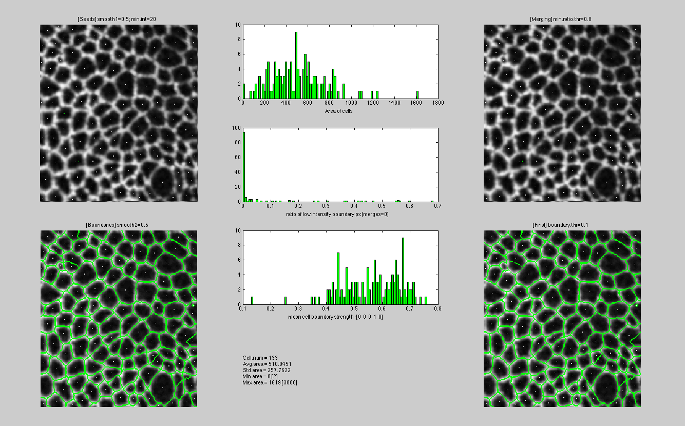

# GUI-Independent segmentation module from EpiTools

this repository contains the segmentation module from EpiTools-Matlab ([/src/src_analysis/module_segmentation](https://github.com/epitools/epitools-matlab/tree/master/src/src_analysis/module_segmentation)) with all the dependencies removed

# example execution

```matlab
%% load example image (Projected Drosophila Wing Disc - Ecad:GFP)
load('ProjIm.mat')

%% crop image for testing (right click -> "Crop Image")
[crop, rect] = imcrop(ProjIm,[]);
close();

%% compute segmentation and output segmentation feedback
s1=0.5;     % first smoothing (seeding)
minA=2;     % minimum cell area
minI=20;    % minimum membrane intensity
mergeT=0.8; % minimum border intensity ratio for merging cells
s2=0.5;     % second smoothing (segmentation)
maxA=3000;  % maximum cell area
boundT=0.1; % mimimal seed/boundary ratio
verbose=1;  % segmentation feedback plot

[segmentation, seeds, labels] = SegmentIm(crop,s1,minA,minI,mergeT,s2,maxA,boundT,verbose);
```

# Segmentation feedback

with `verbose=1` you can obtain a feedback visualization like this


